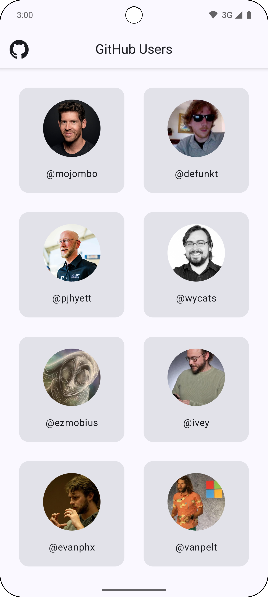
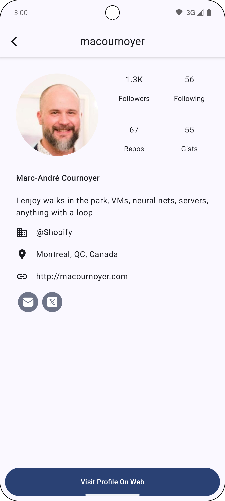
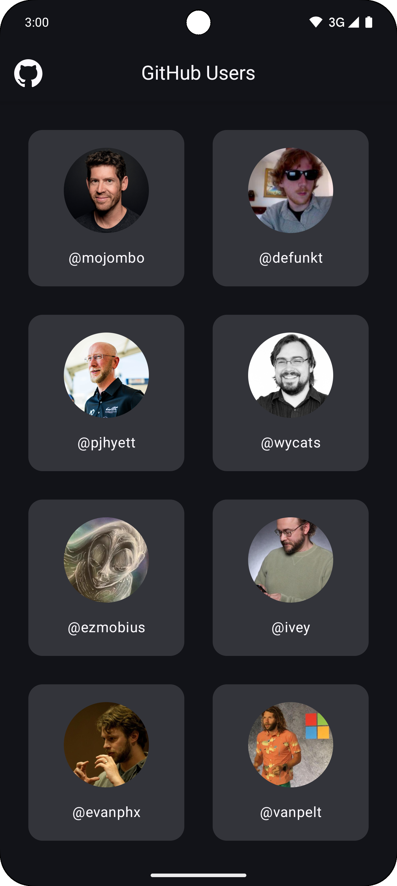
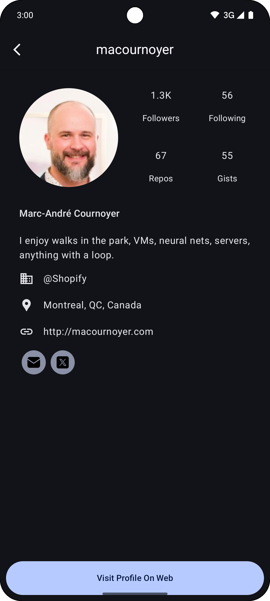

# OctoView

Demo application for displaying Github users and their profiles using Github APIs.

## Features
- MVVM Architecture
- Jetpack Compose
- Compose Navigation
- Coroutines
- Retrofit
- Kotlin Flow
- Hilt

# Build

You need to add the following to your `local.properties` file to make the app and import work:

```*properties*
api.baseUrl=https://api.github.com
api.authToken=<YourGH Token or PAT>
```
The `api.authToken` is a GitHub Personal Access Token (PAT) that is used to authenticate requests to the GitHub API. You can create a PAT in your GitHub account settings. Make sure to give it the necessary permissions for the API endpoints `/users` and `/users/{login}`.

Learn about creating your own GitHub PAT [here](https://docs.github.com/en/authentication/keeping-your-account-and-data-secure/managing-your-personal-access-tokens).

# Screenshots

|                Home Screen                |                    User Details Screen                    |
|:-----------------------------------------:|:---------------------------------------------------------:|
|       |       |
|  |  |